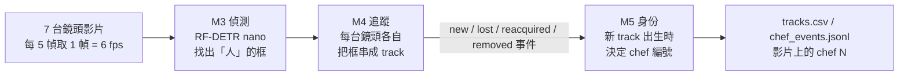

# M4 / M5 方法說明與難度分級 B 套測試結果

> 2026-09-17 · 智慧廚房多鏡頭身份辨識
> 受測系統:`m5_cbiou`(偵測 RF-DETR nano → 追蹤 `rf_cbiou` → 身份 `SpatioTemporalIdentityManager`,`--embedder none`)
> 資料:CHIRLA(辦公室、7 台斜角鏡頭、1080×720、30 fps;每個人衣服不同)
> 逐步紀錄:`handoff/紀錄/2026-09-17_遠端.md`;登記文件:`docs/難度分級交付_預先登記_20260916.md`、`docs/難度分級交付_補充登記_20260917.md`

---

## 摘要

1. **M4(同一台鏡頭內追蹤)**:
   - 找得到人:召回 92%。
   - 但一個人會被切成很多段、段內也會混人:每人每台鏡頭平均 6.8 條 track。
   - 單鏡頭 IDF1 0.448(驗收標準 0.90)。
2. **M5(給身份)**:
   - 只在 track 出生時決定一次,之後不再改。
   - 決定時**沒有任何「這是誰」的資訊**,只有時間、鏡頭關係、同鏡頭的框位置。
   - 結果:正確 10%、誤併 60%、碎裂 30%,59 個人被拆成 693 個身份。
3. **B 套(資料夾 CSV 切法)測試**:
   - 單人單鏡頭連續出現(L1)單鏡頭 IDF1 0.84~0.92,是表現最好的情境。
   - 離開 1~5 秒再回來(L2)降到 0.50。
   - 跨鏡頭(L3)樣本太少(15 段),不能下結論。
4. **影片裡「看起來穩定」不代表認對**:
   - L1_03 的 chef 21 在同一序列被分給 **9 個不同的人**。
   - L2_02 同一個人在 10 秒內換了 **4 個** chef 編號。
5. **今天試的兩個 M5 修法方向**(同鏡頭緩衝期接回、「時間 + 指定鏡頭」)事前估計都讓整體變差:每救回 1 次約多綁錯 2.5 次。
   在沒有身份訊號(外觀或標記)的條件下,**目前找得到的時間 / 位置 / 鏡頭證據已經榨不出改善**。

---

## 1. 整體流程

每一輪(每 5 幀)的處理順序(`scripts/m5_track_video.py`):

| 步驟 | 做什麼 |
|---|---|
| 0 | 7 台鏡頭各讀一幀;偵測框從快取讀(`results/det_cache/coco_nano`),信心 ≥ 0.10 |
| 1 | 每台鏡頭的 M4 各自更新,產生「本輪的 track」與「事件」 |
| 2 | **心跳**:把每條還在的 track 的位置告訴 M5(`on_track_update`) |
| 3 | **事件**:依序把 new_track / reacquired / lost_track / removed 交給 M5;new_track 時做身份決定 |
| 4 | 寫出 `tracks.csv`(逐幀框 + chef)與 `chef_events.jsonl`(每次身份決定的細節) |

---

## 2. M3 偵測

| 項目 | 設定 |
|---|---|
| 模型 | RF-DETR nano,COCO 預訓練權重,**沒有微調** |
| 類別 | 只取「人」(COCO person) |
| 信心門檻 | 快取時 0.05,使用時過濾到 **0.10** |
| 取樣 | stride 5(每 5 幀處理 1 幀) |

⚠ 偵測只回答「這裡有一個人」,**不知道是誰**。玻璃倒影、只露出頭的人、遠處雜物也可能被框起來。

---

## 3. M4 追蹤(同一台鏡頭內)

### 3.1 做法

**每台鏡頭各自一個追蹤器**,彼此不溝通。後端是 Roboflow `trackers==2.6.0` 的 **C-BIoU**(`configs/tracker_rf_cbiou.yaml`):

1. **預測**:每條 track 用 Kalman 濾波預測下一幀框的位置。
2. **配對**:把框向外擴張後再算 IoU(重疊比例,即 C-BIoU),以匈牙利演算法一對一配對偵測與 track。
   參數對映見 `src/m4_track/tracker.py` 的 `rf_kwargs`:
   - 偵測分兩組:**高信心**(> 0.25)與**低信心**(0.1 ~ 0.25)。
   - **第一輪**:高信心偵測 vs 所有 track(含跟丟中),框外擴比例 0.3,相似度門檻 0.2。
   - **第二輪**:剩下的已確認 track vs 低信心偵測,外擴比例 0.5,門檻 0.5。
   - **第三輪**:剩下的高信心偵測 vs 尚未確認的 track,門檻 0.3。
3. **沒配上的偵測**:信心 ≥ 0.35 → 開一條暫定 track,第二次配到才確認(每支影片第一幀例外)。
4. **沒配上的 track**:進入「跟丟」狀態,保留 **30 次更新 = 5 秒**(stride 5 下);期間配回來就「找回」,到期就「移除」。

**只看框的位置與運動,完全不看外觀。**

### 3.2 對 M5 輸出的事件

| 事件 | 意義 | M5 的處理 |
|---|---|---|
| `new_track` | 新的 track 出現 | **決定 chef 編號**(唯一的決定時刻) |
| `lost_track` | 這一輪沒配上 | 記下「預備出口」(時間、最後的框),身份維持在場 |
| `reacquired` | 5 秒內配回來 | 取消預備出口 |
| `removed` | 5 秒到期 | 這條 track 真正結束;若該身份在**所有鏡頭**都沒有 track 了 → 身份標為「已離場」 |

⚠ 同一輪裡 M4 先送 `new_track` 才送 `lost_track`(`src/m4_track/tracker.py:370-379`)——M5 決定新 track 身份時,還不知道同鏡頭的舊 track 剛斷掉。

### 3.3 M4 的表現

7 台、7 個測試序列(`results/m5_step3/m5_cbiou/m4.json`):

| 指標 | 值 | 白話 |
|---|---|---|
| track 總數 | 3,273 | 真人只有 59 位 |
| 召回(全部幀) | 92.4% | 人大多找得到 |
| 誤偵 track 比例 | 34.0% | 三分之一的 track 不是真人(倒影、重複框等) |
| 每人每台鏡頭的 track 數 | 中位數 6、平均 6.8 | 同一人在同一台鏡頭被切成好幾段 |
| 混人的 track | 389 條 | 一條 track 中途換成另一個人 |

排除玻璃倒影嚴重的 camera_5/6 後,單鏡頭指標(5 台,`results/m4_5cam/idf1_cbiou.json`):

| 指標 | 值 | 標準 |
|---|---|---|
| **單鏡頭 IDF1** | **0.448** | 0.90 |
| ID 切換 | 2,497 次 | — |
| MOTA | 0.636 | — |

9/15 修了三輪都沒有有效改善:

| 方法 | IDF1 |
|---|---|
| McByte | 0.471(最好,但權重不可商用) |
| SparseTrack | 0.462 |
| Hybrid-SORT | 0.442 |

主因:斷軌與混人幾乎都發生在**兩人交錯遮擋**時(第一次換人時兩人框互相重疊 94.6%)。

---

## 4. M5 身份綁定(跨鏡頭給 chef 編號)

### 4.1 核心規則

`src/m5_reid/identity_st.py`:

- **只在 `new_track` 那一刻決定一次**:
  - 接到某個已存在的 chef。
  - 或開一個新 chef(編號 +1)。
- **決定後不再檢查**:這條 track 活多久就掛著這個編號;M4 混人,編號也跟著錯。
- chef 編號只是建立順序,本身沒有意義;同一編號在所有鏡頭同一顏色。

### 4.2 候選名單:只有兩個來源

| 來源 | 條件 | 分數怎麼算 |
|---|---|---|
| **(a) 已離場的身份**(轉場路徑) | 該身份在**所有鏡頭**的 track 都已被移除(5 秒緩衝到期),且 100 秒內 | 時間證據:依鏡頭對分三種(見 4.3)+ 同鏡頭時加位置證據 + 外觀項 |
| **(b) 此刻在「重疊鏡頭」上的身份**(重疊路徑) | 該身份正被**另一台**、且在重疊清單內的鏡頭看著 | 常數 `5.0 − ln k` + 外觀項(k = 那台鏡頭上掛著幾個身份) |

⚠ **不在這兩類的身份不會被考慮**。常見的漏網情況:

- 同鏡頭剛斷軌(舊 track 還在 5 秒緩衝)。
- 身份還掛在別台不重疊鏡頭。
- 身份被多人共用、永遠不會「離場」。

9/13 的歸因:可歸因的 2,101 次決定中,**849 次(40%)正確答案根本不在候選名單**。

### 4.3 「時間 + 鏡頭」證據(拓撲 `configs/fix_grid/base.yaml`)

每一對鏡頭有自己的規則:

| 鏡頭關係 | 內容 | 例 |
|---|---|---|
| 轉場連結(3 條) | 走過去的典型時間(混合「直走 + 逗留」分布) | camera_6 → camera_7:0.62 ± 0.48 秒;camera_2 → 6:3.26 ± 1.85 秒;camera_7 → 5:10.5 ± 4.3 秒 |
| 同一台鏡頭 | 斷軌後重現,時間指數衰減(τ 2 秒、上限 15 秒)+ **位置證據**(以身高為單位的位移) | — |
| 未建模路徑 | 寬分布 + 負先驗(−2) | 其餘鏡頭對 |
| 重疊清單(7 對) | 可同時看到同一人 | c2-c3、c2-c4、c2-c5、c3-c4、c3-c5、c4-c5、c5-c6 |

⚠ 時間參數只從訓練側 `seq_000/001/002` 估;重疊清單用了全部 10 個序列(有洩漏,已揭露)。
⚠ 使用者 9/15 指出實際同一個房間的只有 camera_2 + 3,清單與實際空間不一致,尚未修改。

### 4.4 決定門檻

- **門檻 = ln 5 = 1.609**:誤併(把兩人當成一人)的代價設為碎裂(一人拆成兩個身份)的 5 倍。
  - 誤併是靜默錯誤,下游無法發現。
  - 碎裂可以用「身份數 > 排班人數」偵測。
- 最高分的候選 ≥ 1.609 → 接上;否則開新 chef。

### 4.5 目前設定下的實際行為(`docs/M5_綁定規則實測_20260915.md`)

| 現象 | 原因 |
|---|---|
| **外觀項對每個候選固定扣 1.19 分** | `embedder none` 讓外觀向量全零,cosine = 0,`app_lr.llr(0) = −1.1937` |
| **重疊路徑:k ≤ 8 必定接上** | `5.0 − ln k − 1.19 ≥ 1.609` 等價於 k ≤ 8;CHIRLA 單台最多約 9 人 → 幾乎不會拒絕,**也分不出是誰** |
| **轉場路徑:數學上不可能接上** | c6→c7 時間剛好 0.62 秒時最高 2.678 − 1.194 = **1.484 < 1.609** |
| 成功接上的 2,286 次全部來自重疊路徑的常數分數 | — |

### 4.6 關閉中的功能

| 功能 | 狀態 |
|---|---|
| 外觀特徵(DINOv2 / CHIRLA 微調) | 關閉:跨鏡頭 d′ 只有 0.118~0.131,且廚房戴口罩穿同款制服 |
| 地面校正、速度、方向 | 關閉:CHIRLA 沒有相機標定 |
| F1 margin、F2 同鏡頭互斥、P1 重新投票 | 關閉(實測無效或無證據可投) |

### 4.7 M5 的表現

7 台、7 個測試序列(`results/m5_step3/m5_cbiou/eval_m4m5_report.json`):

| 指標 | 值 |
|---|---|
| 身份決定次數 | 3,273(其中誤偵 track 1,113、第一次出現 59、可評估 2,101) |
| **正確率** | **10.00%** |
| **誤併率** | **59.54%** |
| **碎裂率** | **30.46%** |
| M5 IDF1 | 0.157 |
| 身份數 / 真人數 | 693 / 59(每人平均被拆成 14.9 個) |
| 重疊路徑:碎裂 / 誤併 | 2.77% / 79.93% |
| 轉場路徑:碎裂 / 誤併 | 55.05% / 44.40% |

---

## 5. 難度分級 B 套(資料夾 CSV 切法)

### 5.1 B 套是什麼

使用者確認:`D:/yizhen/CHIRLA/CHIRLA_data/CHIRLA/` 裡的三個 CSV 是**這次交付的切法**。

| Level | CSV 列數 | 條件(已用標註逐列驗證) |
|---|---|---|
| L1 | 178 | 單一鏡頭;窗內**逐幀**只有這一人;連續 ≥ 5 秒(別人入鏡就切斷) |
| L2 | 16 | 單一鏡頭;離開 1.1~4.9 秒後回來;窗內(含離開期間)逐幀沒有別人 |
| L3 | 17 | 跨 2~3 台鏡頭;選定鏡頭上逐幀只有這一人(其他鏡頭 4~10 人);overlapping 12 / sequential 5 |

- **做法**:
  - 系統在整段影片上跑一次,每一段只是截出時間範圍,再用標註算指標。
  - 起訖點往內對齊到取樣格點,最多縮 4 幀。
- **分桶**:
  - 訓練側 `seq_000/001/002`。
  - 測試側 `seq_004/006/007/024/025/026`。
  - `seq_020` 單獨報(它同時屬於 CHIRLA 官方 Re-ID 的訓練集)。
- **`manual_check/` 9 支影片**:做表的人用來**檢查切法**的影片,畫的是標註答案(綠框目標、紅框他人),**不是系統測試結果**。

### 5.2 驗收(全部通過)

| # | 檢查 | 結果 |
|---|---|---|
| V2′ | 重算 5 台單鏡頭 IDF1 與 9/15 提交值相同 | PASS |
| V3 | B 套 10 段影片 h264、幀數 = 取樣幀數、> 10 kB | 10/10 |
| V4 | L1/L2 算不出誤併率(含彙總層) | PASS |
| V7 | 訓練側補跑設定與 `m5_cbiou` 一致 | PASS |
| V8 | 211 列 ID / 鏡頭 / 對齊 0 不一致;抽 5 列對標註 | PASS |
| V9 | 登記文件 §1–§7 未改、`world.py` 未動、`m5_step3` 未改 | PASS |

### 5.3 結果

**L1 / L2(單鏡頭)**

| 組 | 段數 | 單鏡頭 IDF1 | ID 切換 | 正確率 | 碎裂率 | 誤併率 | 每人拆成幾個身份 |
|---|---|---|---|---|---|---|---|
| L1 測試側 | 99 | **0.858** | 12 | 25.0% | 75.0% | 不可量測(窗內只有 1 個身份) | 2.0 |
| L1 seq_020 | 25 | **0.915** | 2 | 0.0% | 100.0% | 不可量測 | 1.7 |
| L1 訓練側 | 54 | **0.841** | 9 | 0.0% | 66.7% | 不可量測 | 2.6 |
| L2 測試側 | 13 | 0.502 | 14 | 37.5% | 50.0% | 不可量測 | 2.0 |
| L2 seq_020 | 1 | 0.821 | 1 | 0.0% | 100.0% | 不可量測 | 2.0 |
| L2 訓練側 | 2 | 0.593 | 3 | 0.0% | 100.0% | 不可量測 | 1.5 |

- 「單鏡頭 IDF1」量的是 **M4 track** 在窗內保持同一條的程度;「正確率 / 碎裂率 / 拆成幾個身份」量的是 **M5 chef 編號**。
- 正確率與碎裂率的分母是窗內的新 track 決定(L1 測試側只有 56 次),**樣本小**。

**L3(跨鏡頭)**

| 組 | 段數 | 綁定次數 | 正確率 | 碎裂率 | 誤併率 | 拆成幾個身份 |
|---|---|---|---|---|---|---|
| L3S(同時)測試側 | 10 | 24 | 7.7% | 38.5% | 100%(**僅 1 段可量**) | 1.9 |
| L3T(先後)測試側 | 4 | 9 | 60.0% | 40.0% | 不可量測 | 1.5 |
| L3T seq_020 | 1 | 2 | 100% | 0% | 不可量測 | 1.0 |
| L3S 訓練側 | 2 | 3 | 0% | 100% | 不可量測 | 1.5 |

⚠ B 套 L3 選定鏡頭上只有一個人,**量不到誤併**,也只有 15 段、33 次綁定 → **不能拿來說跨鏡頭不會認錯人**。
那 1 段量得到誤併的(seq_025 人物 7),是 camera_3 的 track 21 在整段序列大多跟著人物 14,這段卻跟著人物 7(M4 混人)。

### 5.4 交付影片

`results/levels/videos/B/`,不進 git。畫面上是系統的框和 chef 編號。

| Level | 訓練側 | 測試側 | 該段自己的單鏡頭 IDF1 |
|---|---|---|---|
| L1 | L1_02(seq_000 c6) | L1_01(seq_025 c7)、L1_03(seq_026 c5) | 0.94 / 0.99、0.54 |
| L2 | 補位(seq_000 c1,固定規則選) | L2_01、L2_02、L2_03 | 0.51 / 0.43、0.33、0.96 |
| L3 | L3_02(seq_000 c6+c7) | L3_01(seq_024 c5+c6)、L3_03(seq_004 c6+c7) | — |

⚠ 影片**不代表平均**:L1 測試側平均 0.858,這兩段一段 0.99、一段 0.54。
⚠ L2 測試側有 3 段,交付只需 1~2 段,待挑選。

### 5.5 與 A 套(專案自訂切法)對照

| | A 套 | B 套 |
|---|---|---|
| L1 定義 / 段數 | 20~60 秒,共 2 段 | ≥5 秒,共 178 段 |
| L1 單鏡頭 IDF1 | 1.000 / 0.818(各 1 段) | 0.84~0.92 |
| L2 定義 / 單鏡頭 IDF1 | 離開 2~30 秒;測試側 0.555(3 段) | 離開 1~5 秒;測試側 0.502(13 段) |
| L3 誤併率 | 53~68%(數百段,段落互相重疊) | 量不到 |

兩套定義差很多,**不可合併平均**。A 套完整數字在 `docs/難度分級交付_預先登記_20260916.md` §8。

---

## 6. 測試後的發現

### 6.1 評估與渲染的實作缺陷(已修正,修正前輸出保留)

| 缺陷 | 影響 | 修正 |
|---|---|---|
| 彙總時把不同段的不同人倒在一起算誤併率 | B 套 L2 印出 12.50%、L3 印出 44.44%,都是跨段湊出來的假數字 | 誤併率只彙集「段本身量得到誤併」的段 |
| 影片在人離開畫面期間整段跳過 | L2 的消失、L3T 的轉場被剪掉(8/17 段) | 改成輸出段內每個取樣幀 |
| L3S / L3T 混在一起彙總 | 違反登記「分開報」 | 依類型分開跑 |

### 6.2 L1_03:畫面穩定,但編號是錯的

seq_026 camera_5,真人 9 號。檢查檔案:`results/levels/check/L1_03/`。

| 系統的框 | 編號 | 實際 |
|---|---|---|
| 中間真人 | chef 21 | 9 號(45 幀都對) |
| 左邊玻璃倒影 | chef 21 | 標註裡沒有 |
| 遠處小框(信心 0.165) | chef 21 | 標註裡沒有 |

**chef 21 在 seq_026 整段被分給 9 個不同的真人**(2、3、5、6、7、9、10、11、14 號),另有 90 次掛在沒有標註對應的框上。
同一段 track 83 先後跟過 11 號 → 9 號 → 10 號。
結論:三個框同編號,不是系統認出「倒影也是這個人」,而是這個編號本來就被很多人共用。

### 6.3 L2_02:同一人 10 秒內換了 4 個編號

seq_004 camera_7,7 號。對照影片:`results/levels/check/L2_02/`。

| 幀 | track | 編號 | 為什麼沒接回上一個身份 |
|---|---|---|---|
| 4780 | 20 | chef 82 | 上一個身份 chef 48 被多人共用,還掛在 camera_2~6 → 不是「已離場」,camera_7 又沒有重疊鏡頭 |
| 4850 | 21 | chef 84 | 人還在畫面上,M4 斷軌;舊 track 20 才 0.17 秒前跟丟,還在 5 秒緩衝 → 不在候選 |
| 4980 | 22 | chef 87 | 7 號同時在 camera_6 被綁成 chef 86;c6-c7 設定為轉場連結,不是重疊 |
| 5020 | 23 | chef 89 | 同 4850,舊 track 22 才 0.33 秒前跟丟 |

每次候選有 33~37 個,正確答案都不在裡面,最高分 −1.07~−3.11,全部開新身份。

### 6.4 兩段 L3 影片:同一人跨鏡頭沒接上

| 影片 | 過程 | 原因 |
|---|---|---|
| L3S 訓練側 seq_000(9 號同時在 c6、c7) | camera_7 新 track 時正確身份 chef 36 排第 4,−4.32 分 | 兩台同時看到要走重疊路徑,但 c6、c7 不在重疊清單 |
| L3T 測試側 seq_004(7 號 c6 → c7) | camera_6 綁對 chef 48;3.6 秒後進 camera_7,chef 48 不在候選 | chef 48 被多人共用,永遠不算離場;就算算,3.6 秒遠離典型的 0.62 秒 |

### 6.5 兩個修法方向的事前估計(只讀,未改系統)

加權成本 = 5 × 綁錯 + 開新(越低越好)。估計只知道實際最高分候選,不模擬改判後的連鎖。

**第 1 輪:同鏡頭緩衝期的舊 track 也放進候選**(`scripts/diag_m5_pending_exit.py`)

| | 測試側 | 訓練側 |
|---|---|---|
| 救回(原本錯 → 對) | 56 | 0 |
| 原本開新 → 改綁錯人 | 137 | 6 |
| 原本對 → 錯 | 2 | 0 |

**第 2 輪:「時間 + 指定鏡頭」**(`scripts/diag_m5_track_exit_variant.py`)

| 變體 | 測試側 Δ對 / Δ開新 / Δ錯 | 測試側成本(實際 3,135) | 訓練側成本(實際 318) |
|---|---|---|---|
| E1 沒有外觀不扣分 | +28 / −93 / +65 | 3,367 | 317 |
| E2 候選改為每台鏡頭最近結束的 track | +54 / −186 / +132 | 3,609 | 342 |
| E3 兩者皆改 | +106 / −380 / +274 | 4,125 | 362 |

- 兩段 L3 影片在 E3 下**仍然接不上**(−1.18、−3.21)。
- 共同原因:
  - 斷軌、轉場時,同一時間窗、同一條路徑上本來就有好幾個人,時間與框位置分不開。
  - 有人停留或繞路時,時間證據也會失準。

---

## 7. 結論與現況

1. **M4**:三輪修法無效,已依規則停下。尚未做的是「只用訓練側調參數」。
2. **M5**:
   - 在沒有身份訊號的條件下,時間 / 位置 / 鏡頭關係這條線今天試了兩輪,估計都讓整體變差。
   - 依「同一問題 3 輪無效就停」,目前是第 2 輪。
3. **根本限制**:
   - 系統決定身份時沒有任何「這是誰」的資訊。
   - 廚房是口罩 + 同款制服 + 斜角鏡頭,外觀也幫不上。
   - CHIRLA(衣服各不相同)上的數字已是上界。
4. **建議的下一步**:
   - 做 9/16 已登記、暫停中的**上限實驗**:如果每次看到人都有身份訊號,訊號要多準,誤併才能降到 1%。
   - 它直接支援業主「是否加可辨識標記」的決定(`docs/業主決策_身份辨識方式_20260915.md`)。

---

## 附錄:檔案位置

| 內容 | 位置 |
|---|---|
| M4 追蹤器 | `src/m4_track/tracker.py`、`configs/tracker_rf_cbiou.yaml` |
| M5 身份管理 | `src/m5_reid/identity_st.py`、`src/m5_reid/evidence.py`、`src/m5_reid/spatiotemporal.py` |
| 拓撲 | `configs/fix_grid/base.yaml` |
| 管線 | `scripts/m5_track_video.py` |
| 系統執行結果 | `results/m5_step3/m5_cbiou/`(測試側)、`results/levels/runs/m5_cbiou_train/`(訓練側) |
| B 套 manifest 與指標 | `results/levels/B/` |
| 交付影片 | `results/levels/videos/B/`(A 套對照:`videos/A/`) |
| 標錯檢查 | `results/levels/check/L1_03/`、`results/levels/check/L2_02/` |
| 修法估計 | `results/m5_pending_exit/` |
